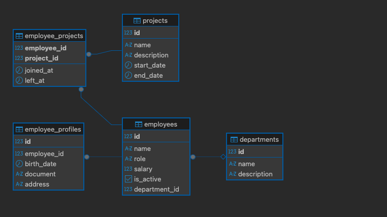

# Employee Manager API

API de gestão de funcionários, departamentos e projetos construída em **NestJS**, usando **PostgreSQL** e integrando com serviços externos como **PokeAPI** e **ViaCEP**.  
O projeto segue uma arquitetura em camadas (Controllers → Services → Repositories), com **DTOs**, **Models de domínio** e **validação de permissões** via decorators e guards.


## 🚀 Como rodar o projeto (API + Banco de Dados)

### 1. Pré-requisitos

- **Node.js** ≥ 20
- **Yarn** instalado globalmente
- **Docker** e **Docker Compose** instalados
- (Opcional) Cliente SQL como **DBeaver**, **TablePlus**, **psql** etc.


### 2. Clonar o repositório e instalar dependências

```bash
git clone <URL_DO_REPOSITÓRIO>
cd employee-manager


yarn
# ou, se preferir:
# npm install

yarn db:up # para iniciar o banco de dados
yarn start:dev # para iniciar o projeto NestJs
```
### Rodando com Docker

Este projeto inclui um `docker-compose.yml` para subir a API Nest e o banco Postgres de forma integrada.

1. Copie o arquivo de variáveis de ambiente:

```bash
cp .env.example .env
```
2. Suba os containers
```bash
yarn docker:up
```
3. Para acompanhar os logs da API:
```bash
yarn docker:logs
```

4. Para derrubar os containers e remover o volume do banco:
```bash
yarn docker:down
```

## ✨ Funcionalidades

### Domínio principal

- **Employees**
  - CRUD de funcionários
  - Associação a **Departments** (1:N)
  - Associação a **Projects** (N:N)
  - **EmployeeProfile** (1:1)
  - Endpoint de **detalhes completos**:
    - Employee + Profile + Department + Projects

- **Departments**
  - CRUD de departamentos

- **Projects**
  - CRUD de projetos
  - Vínculo de funcionários aos projetos (N:N)
  - Listagem de funcionários de um projeto

### Utils

- **PokeAPI**
  - `GET /utils/pokemon`
  - Filtros:
    - `page`, `limit`
    - `name` (contém)
    - `type` (fire, water, grass, etc.)
  - Paginação após filtro, tanto por tipo quanto por nome.

- **CEP (ViaCEP)**
  - `GET /utils/cep/:cep`
  - Consulta CEP em serviço externo e retorna endereço estruturado.

### Segurança / Permissões

- Decorator `@Roles(...)` para declarar roles exigidas na rota
- `RolesGuard` global que lê as roles e valida acesso
- Role simulada via header **`x-user-role`** (ex.: `admin`, `manager`, `user`)
- Integração com Swagger para testar facilmente esse header


## 🏗 Arquitetura

O projeto segue uma arquitetura em camadas, inspirada em MVC, com isolamento de responsabilidades:

- **Controllers**
  - Camada de borda (HTTP)
  - Recebem DTOs de entrada
  - Retornam DTOs de saída
  - Declarar permissões via `@Roles(...)`

- **Services**
  - Contêm **regras de negócio**
  - Trabalham com **Models de domínio** (e não com Entities do TypeORM)
  - Orquestram chamadas a múltiplos Repositories e integrações externas

- **Repositories**
  - ÚNICA camada que conhece as **Entities** do TypeORM
  - Fazem acesso ao banco (PostgreSQL) via `Repository<Entity>`
  - Convertem **Entities → Domain Models** e vice-versa
  - Regra: **nenhuma Entity sai do repositório**

- **Domain Models**
  - Objetos de domínio, usados apenas na camada de Service
  - Ex.: `EmployeeModel`, `EmployeeProfileModel`, `DepartmentModel`, `ProjectModel`, `EmployeeDetailsModel`

- **DTOs**
  - Objetos de transferência para a API (entrada/saída)
  - `Create*Dto`, `Update*Dto` com `class-validator`
  - `*ResponseDto` para saída, com métodos `fromModel(...)`


## 📂 Estrutura de pastas (resumo)

```text
src/
  app.module.ts
  main.ts

  employees/
    domain/
      employee.model.ts
      employee-profile.model.ts
      employee-details.model.ts
    dto/
      create-employee.dto.ts
      update-employee.dto.ts
      employee-response.dto.ts
      create-employee-profile.dto.ts
      update-employee-profile.dto.ts
      employee-profile-response.dto.ts
      employee-details-response.dto.ts
    entities/
      employee.entity.ts
      employee-profile.entity.ts
    repositories/
      employees.repository.ts
      employee-profiles.repository.ts
    employees.controller.ts
    employees.service.ts

  departments/
    domain/
      department.model.ts
    dto/
      create-department.dto.ts
      update-department.dto.ts
      department-response.dto.ts
    entities/
      department.entity.ts
    repositories/
      departments.repository.ts
    departments.controller.ts
    departments.service.ts
    departments.module.ts

  projects/
    domain/
      project.model.ts
    dto/
      create-project.dto.ts
      update-project.dto.ts
      project-response.dto.ts
    entities/
      project.entity.ts
      employee-project.entity.ts
    repositories/
      projects.repository.ts
    projects.controller.ts
    projects.service.ts
    projects.module.ts

  utils/
    utils.module.ts
    pokemon/
      dto/
        search-pokemon.dto.ts
      pokemon.controller.ts
      pokemon.service.ts
    cep/
      dto/
        cep-response.dto.ts
      cep.controller.ts
      cep.service.ts

  auth/
    roles.decorator.ts
    roles.guard.ts
```

## 🧭 Como acessar e usar o Swagger

A documentação interativa da API está disponível em:

> **URL:** `http://localhost:3000/api`

Com a aplicação rodando (`yarn start:dev`), basta abrir esse endereço no navegador.

### 1. Visão geral da UI

No Swagger você vai ver:

- As **tags** da API (por exemplo: `employees`, `departments`, `projects`, `utils`)
- Cada **endpoint** listado com:
  - Método HTTP (`GET`, `POST`, `PATCH`, `DELETE`)
  - URL
  - Descrição (`summary`)
  - Parâmetros, body e schema de resposta
- Um botão **“Try it out”** em cada rota para executar a requisição direto pelo navegador.

### 2. Configurando permissões (x-user-role)

Alguns endpoints exigem roles específicas através do decorator `@Roles(...)`.  
No ambiente atual, a role é simulada via header **`x-user-role`**.

Para testar isso pelo Swagger:

1. Clique em **Authorize** (no topo direito da página).
2. Vai aparecer um campo de segurança com o nome `x-user-role`.
3. Preencha com um valor, por exemplo:
   - `admin`
   - `manager`
   - `user`
4. Clique em **Authorize** e depois em **Close**.

A partir desse momento, **todas as requisições feitas no Swagger** vão incluir o header:

```http
x-user-role: <valor que você informou>
```

## 🗄️ Estrutura do Banco de Dados

A aplicação utiliza **PostgreSQL** como banco relacional, com mapeamento feito via **TypeORM**.  
O modelo foi pensado para demonstrar relações **1:1**, **1:N** e **N:N** entre entidades.




### Tabelas principais

#### `employees`

Tabela principal de funcionários.

- `id` (**PK**, `SERIAL`)
- `name` (`VARCHAR(255)`, **NOT NULL**)
- `role` (`VARCHAR(255)`, **NOT NULL**)
- `salary` (`NUMERIC(12,2)`, **NOT NULL**)
- `is_active` (`BOOLEAN`, **NOT NULL**, default `TRUE`)
- `department_id` (`INTEGER`, `NULLABLE`)
  - **FK** → `departments.id`
  - `ON DELETE SET NULL`

**Relações:**

- **1:N** – Muitos `employees` para um `department`
- **1:1** (via outra tabela) – `employee` ↔ `employee_profiles`
- **N:N** – `employee` ↔ `projects` (via `employee_projects`)

---

#### `employee_profiles`

Tabela de perfil do funcionário (dados adicionais).

- `id` (`INTEGER`, **PK**)  
  - mesmo valor de `employees.id` (espelha o ID do funcionário)
- `employee_id` (`INTEGER`, **UNIQUE**, **NOT NULL**)
  - **FK** → `employees.id`
  - `ON DELETE CASCADE`
- `birth_date` (`DATE`, `NULLABLE`)
- `document` (`VARCHAR(50)`, `NULLABLE`)
- `address` (`TEXT`, `NULLABLE`)

**Relação 1:1:**

- Um `employee` tem no máximo **um** `employee_profile`.
- O `employee_profile` é apagado automaticamente se o `employee` for removido (`ON DELETE CASCADE`).

---

#### `departments`

Tabela de departamentos da empresa.

- `id` (`SERIAL`, **PK**)
- `name` (`VARCHAR(255)`, **NOT NULL**)
- `description` (`TEXT`, `NULLABLE`)

**Relação 1:N:**

- Um `department` pode ter **vários** `employees`.
- Quando um departamento é removido:
  - `employees.department_id` é setado para `NULL` (`ON DELETE SET NULL`), mantendo o histórico do funcionário sem departamento.

---

#### `projects`

Tabela de projetos.

- `id` (`SERIAL`, **PK**)
- `name` (`VARCHAR(255)`, **NOT NULL**)
- `description` (`TEXT`, `NULLABLE`)
- `start_date` (`DATE`, `NULLABLE`)
- `end_date` (`DATE`, `NULLABLE`)

**Relações:**

- Participa de uma relação **N:N** com `employees` via `employee_projects`.

---

#### `employee_projects`

Tabela de junção para a relação **N:N** entre `employees` e `projects`.

- `employee_id` (`INTEGER`, **NOT NULL**)
  - **FK** → `employees.id`
  - `ON DELETE CASCADE`
- `project_id` (`INTEGER`, **NOT NULL**)
  - **FK** → `projects.id`
  - `ON DELETE CASCADE`
- `joined_at` (`TIMESTAMP`, default `NOW()`)
- `left_at` (`TIMESTAMP`, `NULLABLE`)

**Chave primária composta:**

- `PRIMARY KEY (employee_id, project_id)`

Isso garante que:

- Um mesmo `employee` não pode ser cadastrado duas vezes no mesmo `project`.
- Se um `employee` ou `project` for deletado, os vínculos correspondentes são apagados automaticamente.

---

### Resumo das relações

- **1:1**
  - `employees` ↔ `employee_profiles`
- **1:N**
  - `departments` → `employees`
- **N:N**
  - `employees` ↔ `projects` via `employee_projects`

Essa estrutura é a base para os endpoints de:

- Detalhes do funcionário (`GET /employees/:id/details`)
- Vínculo de funcionário a projeto (`POST /projects/:projectId/employees/:employeeId`)
- Listagem de funcionários de um projeto (`GET /projects/:projectId/employees`)

## Testes

O projeto inclui testes unitários para as principais camadas da aplicação (services e controllers), garantindo que a regra de negócio e o tratamento HTTP estejam se comportando como esperado.

### O que está coberto

Atualmente, os seguintes componentes estão cobertos por testes unitários:

- **Employees**
  - `EmployeesService`
    - Criação de funcionário (fluxo feliz e validação de existência de department)
    - Listagem de todos os funcionários
    - Busca de funcionário por ID (encontrado / não encontrado)
  - `EmployeesController`
    - Mapeamento de chamadas HTTP para o service
    - Conversão dos models para:
      - `EmployeeResponseDto`
      - `EmployeeProfileResponseDto`
      - `EmployeeDetailsResponseDto`

- **Departments**
  - `DepartmentsService`
    - Criação de departamento (com e sem descrição)
    - Listagem de todos os departamentos
    - Busca de departamento por ID (encontrado / não encontrado)
    - Atualização de departamento (tratando campos opcionais e caso não encontrado)
    - Remoção de departamento (sucesso / não encontrado)
  - `DepartmentsController`
    - Mapeamento HTTP → service
    - Conversão dos models para `DepartmentResponseDto`

- **Projects**
  - `ProjectsService`
    - Criação de projeto (tratando campos nulos/opcionais)
    - Listagem de todos os projetos
    - Busca de projeto por ID (encontrado / não encontrado)
    - Atualização de projeto (tratando campos opcionais e caso não encontrado)
    - Remoção de projeto (sucesso / não encontrado)
    - Gerenciamento de relacionamentos:
      - `addEmployeeToProject`
      - `removeEmployeeFromProject`
      - `listEmployeesInProject`
  - `ProjectsController`
    - Mapeamento HTTP → service
    - Conversão dos models para:
      - `ProjectResponseDto`
      - `EmployeeResponseDto` (na listagem de funcionários de um projeto)

Em todos os testes, os repositórios são **mockados**, então a suíte roda rápido e **não depende de banco de dados**.

### Como rodar os testes

Primeiro, instale as dependências:

```bash
yarn install
# Rodar toda a suíte de testes:
yarn test
# Rodar um arquivo de teste específico (por exemplo, apenas o service de projects):
yarn test projects.service
```

## Configuração e proteção do `.env`

A aplicação utiliza o `@nestjs/config` em conjunto com um schema de validação (Joi) para garantir que
as variáveis de ambiente necessárias estejam definidas e com tipos válidos **antes** de subir a API.

### Validação das variáveis de ambiente

No `AppModule`, o `ConfigModule` é inicializado com um schema de validação:

```ts
ConfigModule.forRoot({
  isGlobal: true,
  validationSchema: configValidationSchema,
});
```

O schema (por exemplo em src/config/config.validation.ts) garante que:

* Campos obrigatórios como DB_HOST, DB_USERNAME, DB_PASSWORD, DB_DATABASE estejam presentes
* DB_PORT seja numérico
* NODE_ENV tenha um valor válido (development, test, production)
* PORT seja numérico

Se alguma variável obrigatória estiver faltando ou inválida, a aplicação não inicia e exibe um erro
claro de configuração. Isso evita quebrar a aplicação em runtime por causa de .env mal configurado.

### Comportamento do DB_HOST (dentro e fora do Docker)

Para facilitar o desenvolvimento, o projeto foi configurado para funcionar bem tanto:

* rodando a API localmente (yarn start:dev),
* quanto rodando a API dentro do Docker (yarn docker:up).

A ideia é:

* **Fora do Docker** (rodando localmente):
O banco Postgres está rodando em um container, mas exposto na porta 5432 da máquina host.
Nesse caso, a API deve usar:
 ```bash
DB_HOST=localhost
DB_PORT=5432
 ```
 * **Dentro do Docker** (serviço api do docker-compose):
A API enxerga o banco pelo nome do serviço Docker (por exemplo, db).
No `docker-compose.yml`, a seção da API sobrescreve o host:
```yml
api:
  env_file:
    - .env
  environment:
    DB_HOST: db
    DB_PORT: 5432
```
Dessa forma:
* fora do container → `DB_HOST=localhost` (lido do `.env`)
* dentro do container → `DB_HOST=db` (nome do serviço do Postgres no `docker-compose`)